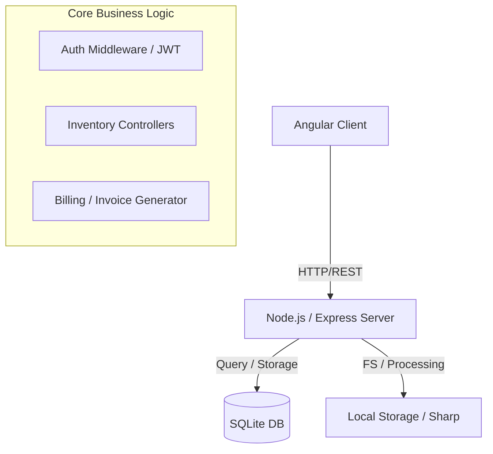
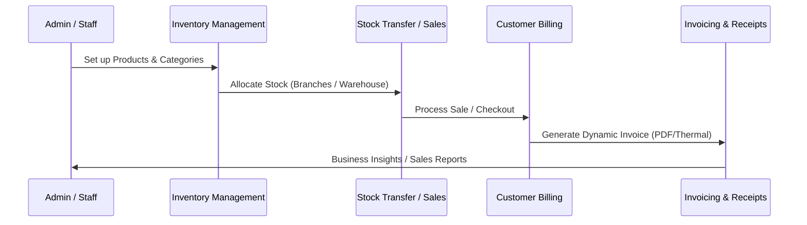

<div align="center">
  
  <h1>Tractly</h1>
  <p><strong>A powerful, minimalist Shop Inventory & Billing System for modern businesses.</strong></p>
  <p><a href="https://naughtycodes.github.io/tractly/"><strong>Visit Product Page →</strong></a></p>

  [](https://opensource.org/licenses/MIT)
  [](https://angular.io/)
  [](https://nodejs.org/)
  [](https://www.sqlite.org/)
</div>

---

## 🚀 Overview

Tracly is a comprehensive solution designed to streamline inventory management and billing for retail shops and multi-branch businesses. Built with a focus on speed, scalability, and ease of use, it provides everything you need to manage your inventory, process sales, and track business performance in one place.

<div align="center">
  
</div>

### 📱 UI Reference

| Login Page | Dashboard (Desktop) | Mobile View |
|:---:|:---:|:---:|
|  |  |  |

---

## 🛠️ Tech Stack

- **Frontend**: [Angular 17+](https://angular.io/) - Modern, component-based framework for a dynamic and responsive UI.
- **Backend**: [Node.js](https://nodejs.org/) & [Express](https://expressjs.com/) - High-performance server for handling APIs and business logic.
- **Database**: [SQLite](https://www.sqlite.org/), [MySQL](https://www.mysql.com/), & [PostgreSQL](https://www.postgresql.org/) - Flexible, multi-engine database support for any scale.
- **Image Processing**: [Sharp](https://sharp.pixelplumbing.com/) - Blazing fast image transformations for product and bill logos.
- **File Uploads**: [Multer](https://github.com/expressjs/multer) - Handling multipart/form-data for image and file storage.
- **Backup & Recovery**: Built-in automated database backup and restore management.

---

## 📐 Architecture Diagram

Tracly follows a client-server architecture with a local database, optimized for high availability and low latency.



---

## 🔄 Core Business Workflow

Tracly simplifies the entire lifecycle from stocking to billing.



---

## ✨ Features

- 🏢 **Multi-Branch Support**: Scalable architecture for managing multiple business locations within a single tenant.
- 📦 **Granular Inventory**: Manage products, categories, stock levels, and historical data with ease.
- 🧾 **Dynamic Billing**: Professional invoice generation with support for taxes, discounts, and custom logos.
- 🚛 **Stock Transfers**: Effortlessly move inventory between branches with full traceabilty.
- 🔒 **Extensive User Management**: Granular role-based access control (RBAC) with secure bcrypt hashing and JWT.
- 💾 **Backup & Restore**: Effortless database management with automated backup and point-in-time recovery.
- 📊 **Business Insights**: Detailed reports on sales, inventory levels, and branch performance.

---

## 🏗️ Installation

1. **Clone the repository**:
   ```bash
   git clone https://github.com/NaughtyCodes/tractly.git
   cd tractly
   ```

2. **Setup the Backend**:
   ```bash
   cd server
   npm install
   npm run dev
   ```

3. **Setup the Frontend**:
   ```bash
   cd ../client
   npm install
   npm start
   ```

The application will be available at: **http://localhost:4200**

---

## 📖 Resources & Documentation

- 🌐 **[Official Product Page](https://naughtycodes.github.io/tractly/)**
- 📘 **[Web User Guide](https://naughtycodes.github.io/tractly/user_guide.html)**
- 📝 **[Markdown User Guide](USER_GUIDE.md)**
- 📐 **[Architecture Overview](https://naughtycodes.github.io/tractly/#architecture)**

---

## 📜 License

Distributed under the **MIT License**. See `LICENSE` for more information.

---

<div align="center">
  <p>Built with ❤️ by NaughtyCodes</p>
</div>
