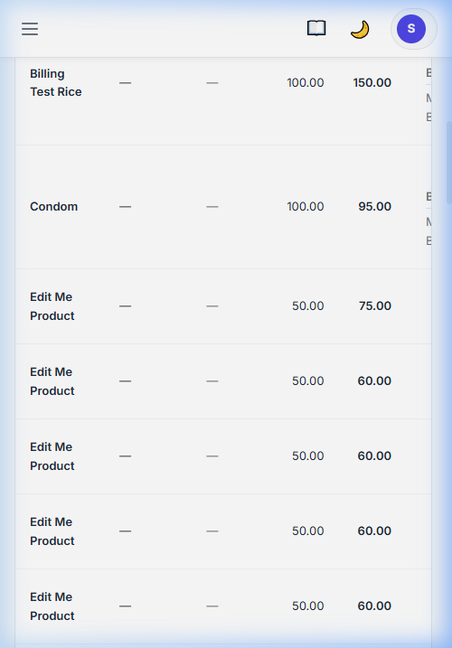
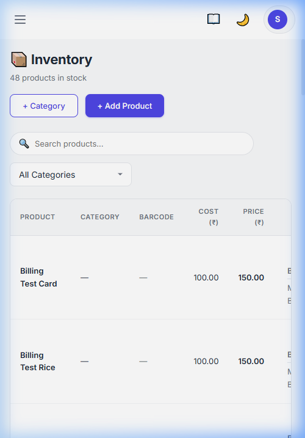

# Tractly | User Guide & Documentation

Welcome to the Tractly User Guide. This document provides comprehensive instructions for setting up, managing, and optimizing your shop inventory and billing operations.

---

## 📋 Table of Contents
1. [Introduction](#introduction)
2. [Getting Started](#getting-started)
3. [Admin Features](#admin-features)
4. [Inventory Management](#inventory-management)
5. [Billing & Invoicing](#billing--invoicing)
6. [Multi-Branch Operations](#multi-branch-operations)
7. [Reports & Analytics](#reports--analytics)
8. [Troubleshooting](#troubleshooting)

---

## 1. Introduction
Tractly is a streamlined Inventory and Billing System designed for modern retail businesses. Whether you operate a single boutique or a multi-city enterprise, Tractly provides the tools to maintain control over your stock and sales.

## 🖼️ Visual Guide

### Login Screen
The entry point into the system, featuring a secure login with a modern, high-contrast interface.

### Dashboard Overview
Your command center for real-time inventory and sales monitoring.

### Mobile-Ready Interface
Tractly is fully responsive and works beautifully on any mobile device or tablet.

## 2. Getting Started
### Setup
- Ensure **Node.js LTS** and **npm** are installed.
- Clone the repository and run `npm install` in both `client` and `server` folders.
- Start the backend: `node src/app.js` (inside `server`)
- Start the frontend: `npm start` (inside `client`)

### Initial Configuration
Log in with your administrator credentials to access the **Settings** panel. Here, you can define your business name, upload your brand logo, and set default tax rates.

## 3. Admin Features
The Admin dashboard provides a bird's-eye view of your entire business.
- **User Management**: Create and manage staff accounts with role-based access.
- **Tenant Configuration**: Configure multi-tenant settings for isolated business data.
- **Global Settings**: Manage branch lists, categories, and payment methods.

### Managing Tenants (Dynamic Schemas)
Tractly natively supports isolated data environments driven by a **True Multi-Tenant** architecture. SuperAdmins can dynamically construct entirely new workspaces alongside dedicated administrative credentials via the `Tenant Management` UI. Once created, tenant-specific users can log in and populate their own segregated "schemas", including Custom Product Meta Fields, Categories, Branches, and Roles, which remain completely invisible to other tenants. When a tenant is deleted, all dynamically constructed schemas and boundaries associated with that tenant are permanently purged to maintain strict isolation boundaries.

> **Instructional Video**: [Placeholder: A recording demonstrating Tenant Creation, Schema configuration, and Data Cleanup will be automatically embedded here once capacity allows]

## 4. Inventory Management
### Adding Products
Navigate to the **Products** section and click **Add New Product**. You can specify:
- Product Name & Category
- SKU/Barcode
- Cost Price & Selling Price
- Opening Stock Levels

### Categories
Organize your inventory by creating logical categories (e.g., "Electronics", "Apparel") for faster searching and better reporting.

### Automated Pricing Strategies
Tractly provides automated inventory valuation methods you can assign directly to a Product. As you stock-in distinct batches of a product across varying wholesale bills, the system handles the complexities of determining accurate cost parameters for accounting, and your eventual consumer selling price.

Four robust strategies are natively integrated:
- **`manual` (Default):** Static. Cost and Selling prices are manually defined by the Admin and never automatically overridden during stock-ins.
- **`weighted_average`:** Real-time smoothing. Automatically calculates the `cost_price` based on the volume and price of *all currently active batches* held across the tenant. Protects against huge seasonal wholesale spikes.
- **`highest_cost`:** Maximum safeguard. Selects the highest cost from any active batch to ensure you don't sell at a loss on older, cheaper inventory when market prices surge.
- **`latest_cost` (LIFO):** Automatically aligns your generic `cost_price` to whatever the very latest stock-in bill dictated.

**Target Margin**: For any animated strategy (Average, Highest, Latest), you can configure a standard `target_margin` (e.g., `25` for 25%). When a new wholesale batch arrives, Tractly will instantly compute the new cost strategy, append the 25% margin, and universally update the retail `selling_price` across all POS terminals in real time.

## 5. Billing & Invoicing
The **Billing Terminal** is optimized for speed.
1. **Search & Add**: Quickly find products by name or SKU.
2. **Apply Discounts**: Add flat or percentage-based discounts to individual items or the entire bill.
3. **Tax Calculation**: Taxes are automatically calculated based on your global settings.
4. **Generate Invoice**: Print thermal receipts or save PDF invoices for your customers.

## 6. Multi-Branch Operations
### Branch Management
Add new branches in the **Branches** section. Each branch maintains its own stock levels and sales history.
### Stock Transfers
Easily move inventory between branches. The system tracks the "Outbound" from the source and "Inbound" at the destination for full traceability.

## 7. Reports & Analytics
Access real-time data to drive your business decisions:
- **Daily Sales**: Track morning-to-evening revenue.
- **Product Performance**: Identify your best-selling items.
- **Stock Alerts**: Get notified when inventory levels across any branch fall below a predefined threshold.

## 8. Troubleshooting
- **Database Connection**: Tractly uses SQLite. Ensure the `server/data/` folder is writable.
- **Image Uploads**: If logos aren't displaying, verify the `server/uploads/` directory permissions.
- **Server Ports**: Default ports are `3001` (Backend) and `4200` (Frontend).

---

For more help, visit our [GitHub Repository](https://github.com/NaughtyCodes/tractly).
